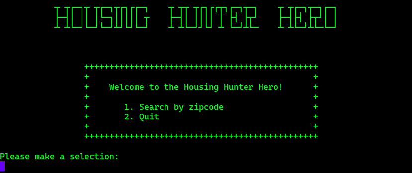
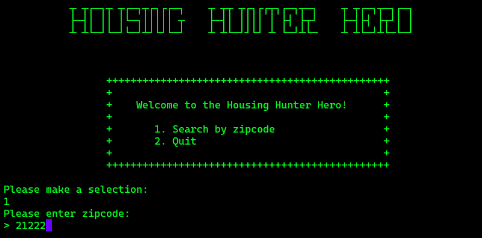
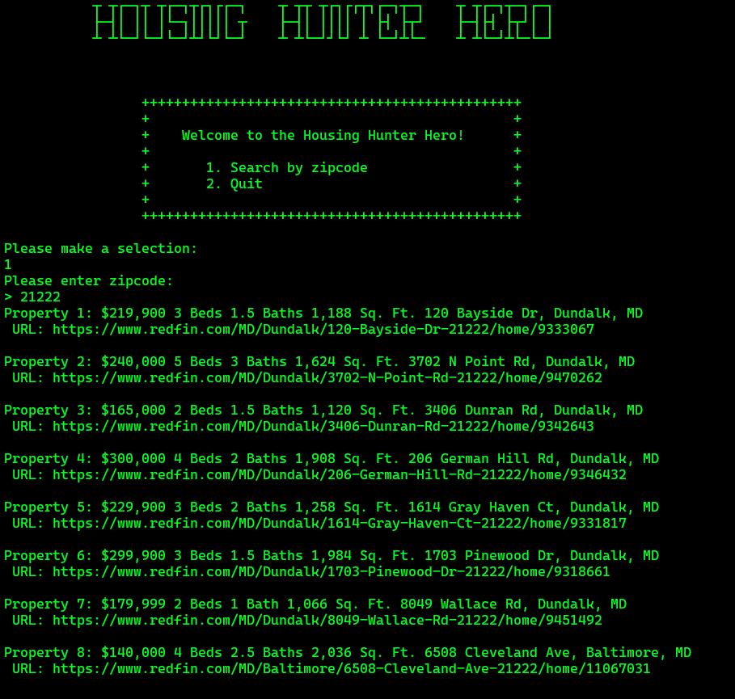

# Project: Housing Hunter Hero

---

## Application

[//]: # (***[Explain your app, should be at least a paragraph. What does it do? Why should I use? Sell your product!]***)

Our application was written in Python.

Many real-estates websites can contain a lot of information and be over whelming or cumbersome for the user trying to get quick to the point metrics for homes. Our app allows the user to see the bare-bones easy to read metrics about homes in a user input zip code of their choosing in seconds, without having to navigate through a busy interface.

---

## Authors

- Domaine Scully
- Monica Ramirez
- Gordon Reilley Jr.
- Brian Sward

---

## Tools Used

PyCharm

- Python
- Pytest
- BeautifulSoup
- Requests
- Json

---

## Recent Updates

#### V 1.0
*Added README and Team Agreement* - 13 Jan 2023
#### V 1.1
Set up request to redfin.com, so we could start our web scraping.  
#### V 1.2
Able to parse html tags and search using `soup.find_all` to narrow down the information we wanted. 
#### V 1.3
Scrubbed the output further to display 8 properties with all the metrics we wanted.
#### V 1.4
Put all of our freely written code into functions and got it working smoothly.
#### V 2.0
Refactored code to take in a user input zip code and return 8 properties in that area.
#### V 2.1
Added a CLI for a clean user experience.
#### V 2.2
Added testing to make sure we were returning the information we expected and work out and small bugs. 

---
## Data Flow

[//]: # (***[Add a clean and clear explanation of what the data flow is. Walk me through it.]***)


---

## Trello Board & Software Requirements

- [Trello Board](https://trello.com/b/D86U6RNM/housing-hunter-hero)
- [Software Requirements](./project_prep/requirements.md)
---
## Getting Started

Clone this repository to your local machine.

```
$ git clone https://github.com/housing-hunter-hero/housing-hunter-hero.git

```
Once downloaded, activate your virtual environment and install all requirements. then run `python housing_hunter.py/main.py`

---

## Usage

[//]: # (***[Provide some images of your app with brief description as title]***)

### Welcome Menu


### User Input - Zip Code


### Final Output


---

For more information on Markdown: https://www.markdownguide.org/cheat-sheet