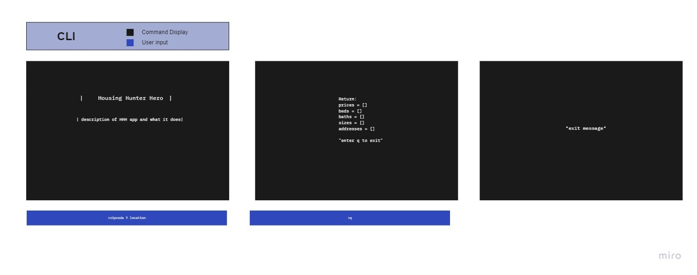
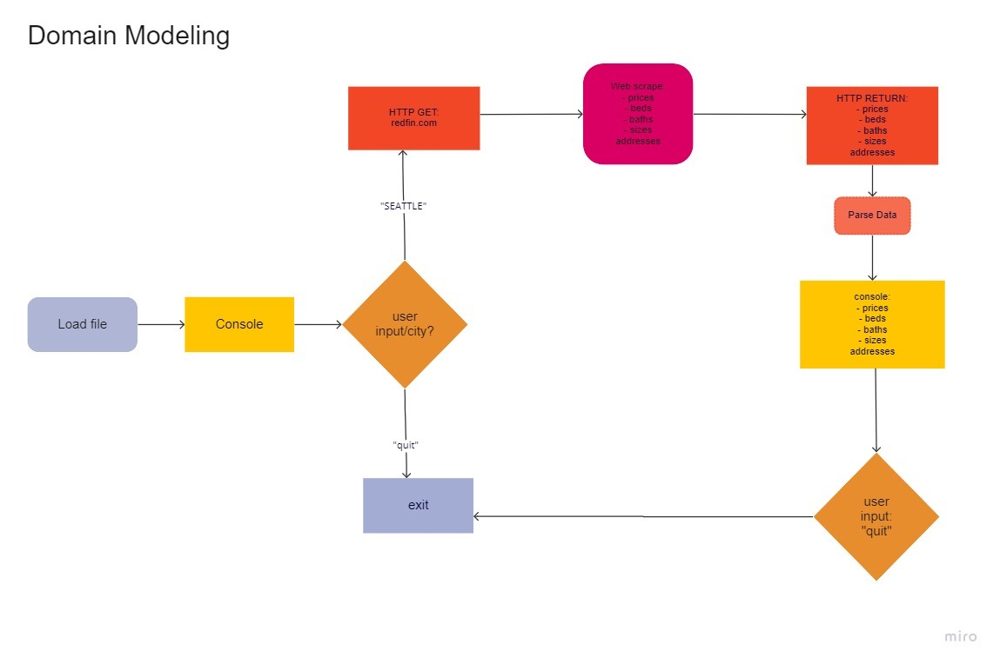

# Software Requirements

---

## Vision

### What is the vision of this product?

The goal of this project is to create a streamlined real-estate web scrapper application. The console application allows the user to come to our app and then receive a nicely formatted feed in their console displaying local listings for the Seattle area. Listing information will include topics like prices, beds, baths, sizes, and addresses.

### What pain point does this project solve?

Many real-estates websites can contain a lot of information and be over whelming or cumbersome for the user trying to get quick to the point metrics for homes. Our app allows the user to see the bare-bones easy to read metrics about homes in the Seattle area in seconds, without having to navigate through a busy interface.

### Why should we care about your product?

Time is limited and our app allows home buyers and real-estate agents to quickly get the information they need so they can do more important tasks in their lives.

## Scope (In/Out)

>IN

* Use beautiful soup to Web Scrape a housing website to retrieve recent sales and current listings in the Seattle area.
* Read and write that information to a file.
* Display that information in trends to the user.

>OUT

* The application is not going to be deployed
* The application will not have a login or authentication feature

## Minimum Viable Product

### What will your MVP functionality be?

Console application that gives the user relevant information on the housing market in the Seattle area. The application returns attractively formatted housing metric results (scraped from Redfin) and allows the user to scroll through the results. 

### What are your stretch goals?

* Be able to compare information collected to try and predict the housing market's future.
* Get mortgage information as well as housing prices like interest and approval rates.
* Our housing hunter hero will also give clients an update to their email of a particular property they are interested in buying.

## Functional Requirements

* Users can request info about the Seattle housing market.
* Users will receive concise metrics on categories like:
  * prices 
  * beds
  * baths
  * sizes
  * addresses

## Data Flow

## Non-functional requirements

* **Usability** 
  * Our application uses a python library to format console text for better readability. This includes size, spacing and color.

* **Testability** 
  * We will use pytest for testing our application. 
  * We follow principles of test driven development.